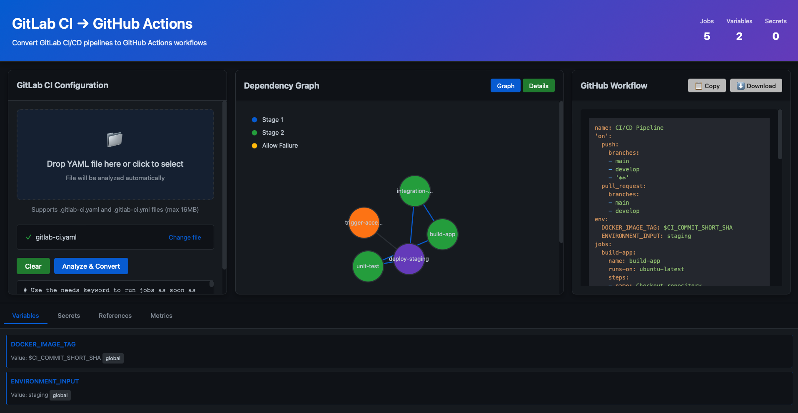

# GitLab CI to GitHub Actions Converter

A comprehensive tool for analyzing GitLab CI pipelines and converting them to GitHub Actions workflows with visualization of dependencies, variables, and secrets.

## Features

- 📊 **Visual Dependency Graph**: Interactive D3.js visualization of job dependencies and pipeline structure
- 🔄 **Automatic Conversion**: Convert GitLab CI YAML to GitHub Actions workflows
- 🔍 **Deep Analysis**: Extract and visualize variables, secrets, and job references
- 📈 **Pipeline Metrics**: Calculate critical paths and detect circular dependencies
- 🚀 **Web UI**: Modern, responsive interface hosted on GitHub Pages
- 📁 **File Upload**: Drag-and-drop or file input for GitLab CI files
- 💾 **Export**: Download generated GitHub workflows directly

## User Interface



*The web interface provides a modern, intuitive design with real-time visualization of pipeline dependencies and automatic workflow conversion.*

## Project Structure

```
g2g-converter/
├── backend/
│   ├── app/
│   │   ├── models/              # Data models
│   │   │   ├── gitlab_config.py
│   │   │   ├── github_workflow.py
│   │   │   └── dependency_graph.py
│   │   ├── parsers/             # YAML parsing
│   │   │   └── gitlab_parser.py
│   │   ├── converters/          # Conversion logic
│   │   │   ├── gitlab_to_github.py
│   │   │   └── graph_builder.py
│   │   └── main.py              # Flask API
│   ├── run.py                   # Application entry point
│   └── requirements.txt         # Python dependencies
├── frontend/
│   ├── index.html               # Main UI
│   ├── src/
│   │   ├── js/
│   │   │   ├── app.js           # App initialization
│   │   │   ├── api-client.js    # API communication
│   │   │   ├── graph-renderer.js # D3.js visualization
│   │   │   └── ui-controller.js # UI logic
│   │   └── css/
│   │       └── style.css        # Styling
│   └── examples/                # Example YAML files
├── tests/
├── .github/
│   └── workflows/               # GitHub Actions workflows
├── README.md
└── LICENSE
```

## Installation

### Backend Setup

1. **Clone the repository**
   ```bash
   git clone https://github.com/yourusername/g2g-converter.git
   cd g2g-converter/backend
   ```

2. **Create Python environment**
   ```bash
   python -m venv venv
   source venv/bin/activate  # On Windows: venv\Scripts\activate
   ```

3. **Install dependencies**
   ```bash
   pip install -r requirements.txt
   ```

4. **Run the API server**
   ```bash
   python run.py
   ```

   The API will be available at `http://localhost:5000`

### Frontend Setup

1. **Navigate to frontend directory**
   ```bash
   cd ../frontend
   ```

2. **Serve locally (for development)**
   ```bash
   python -m http.server 8000
   ```

   Open `http://localhost:8000` in your browser

3. **Build for GitHub Pages**
   ```bash
   # Frontend is a static site - ready to deploy as-is
   ```

## Usage

### Via Web Interface

1. Start the backend API server (see Installation)
2. Open the frontend in your browser
3. Either:
   - Upload a `.gitlab-ci.yaml` file by dragging and dropping
   - Paste YAML content directly into the editor
4. Click "Analyze & Convert"
5. View the dependency graph and generated GitHub workflow
6. Download the workflow file for use in your repository

### Via API

#### Convert GitLab CI to GitHub Actions

```bash
curl -X POST http://localhost:5000/api/convert \
  -H "Content-Type: application/json" \
  -d '{
    "yaml_content": "stages:\n  - build\n  - test\n\nbuild_job:\n  stage: build\n  script:\n    - echo Building..."
  }'
```

**Response:**
```json
{
  "success": true,
  "github_workflow": "name: CI/CD Pipeline\non:\n  push:\n    branches: [main]...",
  "gitlab_config": {
    "stages": ["build", "test"],
    "jobs": [...],
    "variables": [...],
    "secrets": [...]
  }
}
```

#### Analyze Pipeline

```bash
curl -X POST http://localhost:5000/api/analyze \
  -H "Content-Type: application/json" \
  -d '{"yaml_content": "..."}'
```

**Response includes:**
- Dependency graph
- Pipeline metrics
- Circular dependency detection
- Critical path analysis
- Variable and secret extraction

#### Upload File

```bash
curl -X POST -F "file=@.gitlab-ci.yaml" \
  http://localhost:5000/api/upload
```

#### Validate YAML

```bash
curl -X POST http://localhost:5000/api/validate \
  -H "Content-Type: application/json" \
  -d '{"yaml_content": "..."}'
```

## API Endpoints

| Method | Endpoint | Description |
|--------|----------|-------------|
| GET | `/api/health` | Health check |
| POST | `/api/convert` | Convert GitLab CI to GitHub Actions |
| POST | `/api/analyze` | Analyze pipeline and generate dependency graph |
| POST | `/api/upload` | Upload and process YAML file |
| POST | `/api/validate` | Validate YAML syntax |

## Features in Detail

### GitLab CI Parser

- Parses stages, jobs, variables, and secrets
- Extracts job dependencies and artifacts
- Handles GitLab CI advanced features (rules, needs, when conditions)
- Supports variable expansion and protection flags

### GitHub Actions Converter

- Converts GitLab stages to GitHub job workflows
- Maps job dependencies to GitHub `needs`
- Converts GitLab variables to GitHub secrets/env
- Generates setup actions for common languages (Python, Node.js, Ruby, Go, Java)
- Handles artifact uploads and caching

### Dependency Graph

- Visual representation using D3.js
- Interactive node highlighting
- Displays job stages with color coding
- Shows artifact and direct dependencies
- Detects and highlights circular dependencies

### Pipeline Analytics

- Total jobs and stages count
- Variable and secret count
- Dependency metrics
- Critical path calculation
- Circular dependency detection
- Average job dependency count

## GitHub Pages Deployment

1. **Create GitHub Repository**
   ```bash
   git init
   git add .
   git commit -m "Initial commit"
   git branch -M main
   git remote add origin https://github.com/yourusername/g2g-converter.git
   git push -u origin main
   ```

2. **Enable GitHub Pages**
   - Go to repository Settings
   - Scroll to "GitHub Pages"
   - Select "Deploy from a branch"
   - Select `main` branch and `/root` folder
   - Click "Save"

3. **Configure for API**
   - Update `frontend/src/js/api-client.js` base URL for production
   - Deploy backend API separately (e.g., using Heroku, AWS, DigitalOcean)

## Example GitLab CI File

See [examples/](frontend/examples/) for sample `.gitlab-ci.yaml` files.

## Supported GitLab CI Features

- ✅ Stages and job ordering
- ✅ Variables (global and job-level)
- ✅ Secrets (masked, protected variables)
- ✅ Dependencies and needs
- ✅ Artifacts and caching
- ✅ Before/after scripts
- ✅ Docker images
- ✅ Job conditions (only, except, when)
- ✅ Rules and workflow conditions
- ✅ Timeout and retry policies

## Converted GitHub Actions Features

- ✅ Workflows with triggers
- ✅ Jobs and steps
- ✅ Environment variables
- ✅ Artifact uploads
- ✅ Job dependencies (needs)
- ✅ Container support
- ✅ Conditional execution
- ✅ Timeout configuration

## Development

### Testing

```bash
cd backend
python -m pytest tests/
```

### Code Quality

```bash
# Linting
flake8 app/

# Type checking
mypy app/
```

## Environment Variables

Backend configuration via `.env`:

```env
FLASK_ENV=development
FLASK_DEBUG=True
CORS_ORIGINS=*
MAX_FILE_SIZE=16777216
```

## Performance

- Handles pipeline files up to 16MB
- Real-time validation and parsing
- Optimized D3.js rendering for 100+ jobs
- Incremental graph building

## Browser Support

- Chrome/Edge 90+
- Firefox 88+
- Safari 14+

## Limitations

- GitLab includes feature not fully supported
- Manual job approval workflows converted to conditional execution
- Some proprietary GitLab features may require manual adjustments

## Contributing

Contributions are welcome! Please:

1. Fork the repository
2. Create a feature branch (`git checkout -b feature/AmazingFeature`)
3. Commit changes (`git commit -m 'Add AmazingFeature'`)
4. Push to branch (`git push origin feature/AmazingFeature`)
5. Open a Pull Request

## License

MIT License - see LICENSE file for details

## Support

For issues, questions, or suggestions:
- Open an issue on GitHub
- Check existing documentation
- Review example files

## Roadmap

- [ ] Support for GitLab CI templates
- [ ] Batch conversion of multiple files
- [ ] Custom conversion rules
- [ ] Integration with GitHub API for direct workflow creation
- [ ] Advanced rule syntax conversion
- [ ] Performance profiling and optimization
- [ ] Mobile-responsive improvements

## Changelog

### v1.0.0
- Initial release
- GitLab CI parsing and GitHub Actions conversion
- Interactive dependency visualization
- Web UI with drag-drop file upload
- REST API endpoints
- GitHub Pages support
